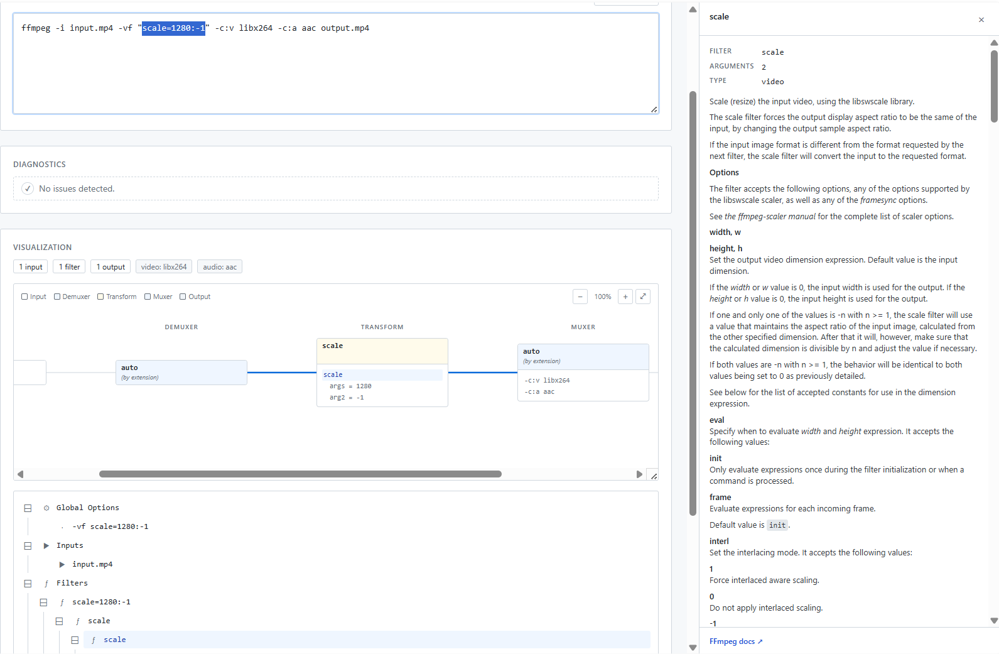
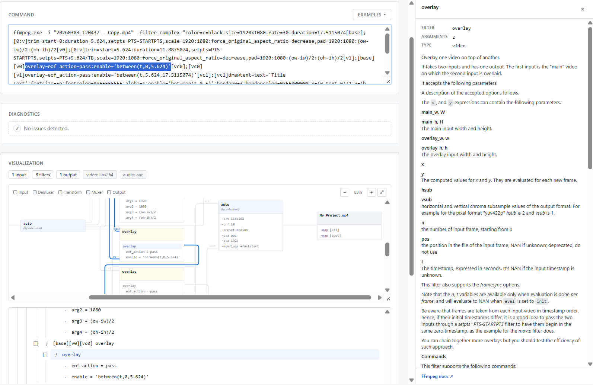

# Simply FFmpeg Parser

A browser-based FFmpeg command-line parser and visualizer. Paste any `ffmpeg …`
invocation and the app will tokenize it, resolve every flag against a real
FFmpeg version's documentation, render the input/filter/output graph as a
flow chart, list the parsed tree, and surface diagnostics for unknown flags,
missing values, bad enum/int/float values, missing outputs, and other common
mistakes.

The app runs entirely client-side. It never executes ffmpeg — instead it
ships pre-extracted per-version metadata bundles (options, codecs, filters,
muxers, demuxers, protocols, bitstream filters) generated from the upstream
FFmpeg sources by a companion Python CLI.

**Live app:** <https://dbakuntsev.github.io/simply.ffmpeg-parser/>

## Screenshots




## Features

- **Multi-version support.** Switch between FFmpeg versions (3.4 through the
  latest release); the version selector reloads the bundle and re-analyzes
  the current command against that version's option/filter set.
- **Live analysis.** The textarea auto-analyzes after a short debounce, so
  edits are reflected immediately without a button click.
- **Pipeline chart.** A railroad-style diagram with five stage columns
  (input → demuxer → transform → muxer → output) that traces the
  processing pipeline implied by `-map`, `-filter_complex` labels, file
  pads (`0:v`), and per-output options. Rails carry stream-type labels
  where the routing makes them inferrable.
- **Tree list.** A structured view of every parsed token grouped by scope
  (globals, per-input, per-output, per-filter-chain).
- **Inspector drawer.** Click any node in the chart or tree to open a
  side-drawer (or modal on smaller screens) with the option's official
  description, accepted values, scope, and a link into the rendered FFmpeg
  HTML reference for that exact version. Selecting a node also highlights
  the matching span in the command textarea (offset-aware — it sees through
  quotes into filtergraph args) and scrolls it into view.
- **Diagnostics panel.** Per-token warnings and errors with click-to-jump
  highlighting back into the textarea.
- **Filter parsing.** `-filter_complex`, `-vf`, `-af`, and `-lavfi` are
  all parsed as filtergraphs with the same offset-aware decomposition into
  chains, steps, and arguments — quote-, paren-, and escape-aware, with
  support for both single and double quotes.

## Repo layout

```
web/                  Vite + React + TypeScript SPA (this README)
metadata-extractor/   Python CLI that produces the per-version JSON bundles
                      and rendered HTML reference docs the SPA consumes
.github/workflows/    GitHub Actions: extract metadata + build SPA + deploy
                      to GitHub Pages
```

The SPA's metadata lives under `web/public/metadata/ffmpeg/<version>/` and
the rendered HTML reference under `web/public/doc/ffmpeg/<version>/`. Both
are gitignored — they are regenerated by the extractor during CI. The
top-level `index.json` listing the available versions (plus per-file cache
buster tokens) is also generated by CI.

## Metadata extractor

The JSON bundles and HTML reference pages the SPA consumes are produced by a
separate Python CLI under [`metadata-extractor/`](metadata-extractor/). It
walks an FFmpeg git checkout, picks the tags to process, parses each tag's
Texinfo and `libav*` C sources, and emits one bundle per version plus a
rendered single-page HTML reference. It is invoked during the GitHub
Actions deploy workflow to refresh the SPA's data on every release.

See [METADATA_EXTRACTOR.md](METADATA_EXTRACTOR.md) for what it extracts,
how it does it, how to run it locally, and how the deploy workflow wires
everything together (including the cache-buster scheme).

## Local development

Prerequisites: Node.js 20+ and npm.

```bash
cd web
npm install
npm run dev      # starts Vite on http://localhost:5173
npm run build    # production build into web/dist
npm run preview  # serve the production build locally
```

`vite.config.ts` sets `base: "./"` so the built bundle works from any static
subpath — no rebuild is needed to host it under a different prefix.

### Working with metadata locally

`npm run dev` will look for the version index at
`web/public/metadata/ffmpeg/index.json` and load bundles from sibling
per-version directories. Those files are produced by the extractor — see
[METADATA_EXTRACTOR.md](METADATA_EXTRACTOR.md) for how to generate them
against a local FFmpeg checkout if you want to run the SPA in your dev
environment. You only need to (re)run the extractor when you want to add a new
FFmpeg version or pick up upstream changes.

## Tech stack

- **React 18** + **TypeScript** + **Vite** for the SPA shell and build.
- **D3 v7** for the flow chart layout and rendering.
- **Tailwind CSS**
- **marked** for rendering option/filter description Markdown surfaced in
  the inspector.

The parser itself has no third-party dependencies — it is a tokenizer + semantic 
resolver under `web/src/parser/`.

## License

The source in this repository is MIT — see [LICENSE](LICENSE).

The metadata bundles and HTML reference pages the deployed app serves are
*derivative works* of FFmpeg (LGPL v2.1+), x264 (GPL v2+) and x265 (GPL v2+),
distributed under those licenses rather than MIT. They are generated at build
time and never committed. See
[THIRD-PARTY-LICENSES.md](THIRD-PARTY-LICENSES.md) for the full breakdown and
how attribution is bundled into the deploy.
